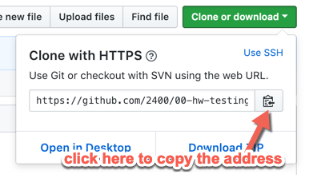

## Homework 1 (Testing Git/GitHub)

### 10 Points

### Due: Monday January 27, 2020 at 11:59 PM.

---

The purpose of this assignment is to test Git/GitHub workflow.

---

### Name: \<Enter your name>

### Email: \<Enter your OU email>

### GitHub Account: \<Enter your GitHub account name>

### Programming Experience:

---


### Instructions

- Refer to [Lab2](https://github.com/2400-sp-20/git-lab) for a reference on using Git/GitHub
- Clone this repository on your machine. Open a terminal/Powershell window.
  - First find the repository's remote address

  

- Navigate to the folder where you want to place your repository directory. It is recommended that you keep all your assignments in a single folder. Issue the following commands:

    ```console
    git clone <repository address>     # Ctrl-v or Cmd-v to paste the address
    ls                                 # You should see a newly created repository folder
    ```
    > Note: You may be asked to enter your GitHub credentials.

### Update this `README.md` file

- Open the repository folder in your favorite editor (e.g. VS Code)
- Open the file `README.md` and make the following additions above:
  - Add your name
  - Add your email
  - Add your GitHub account name.
  - Tell me about your previous programming experience. Did you learn it on your own? Did you take a class? What class did you take? What computer languages do you know and how well?

- Add and Commit your changes.

    ```console
    git add README.md
    git commit -m "Enter a commit message"
    ```

- To submit your assignment, push your repo to GitHub.
    ```console
    git push
    ```
    > Note: You may be asked to enter your GitHub credentials.

  - Find your repository on `GitHub` by visiting [https://github.com/2400-sp-20/](https://github.com/2400-sp-20/)
  - Copy the url address of your repository
  - Login to Blackboard and submit your repository url under `HW1, Testing Git/GitHub` assignment

---

### That's it, you are DONE!